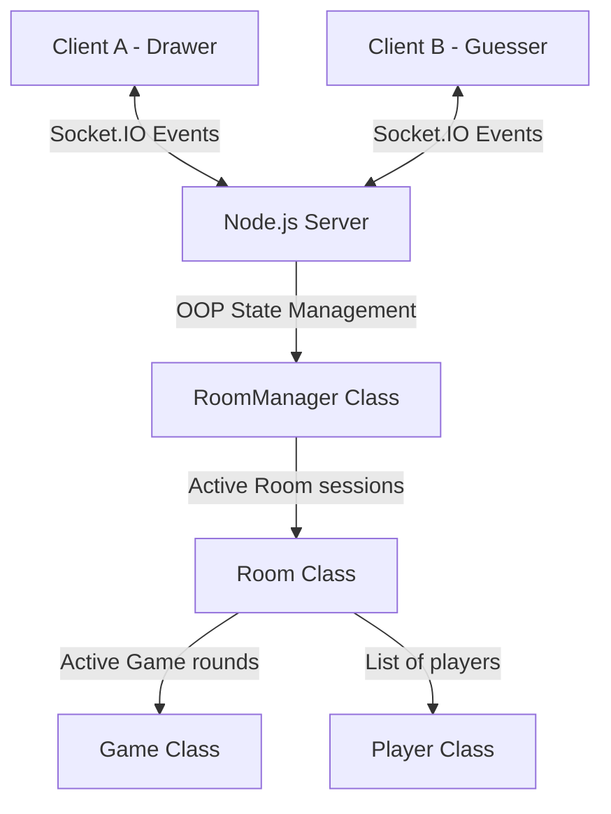

# Skribbl.io Clone

An end-to-end pictionary game clone supporting multiplayer rooms, real-time canvas synchronization, custom drawing tools, turn-based round logic, guessing chat with automatic point calculations, and final game podium scoreboards.

Built with **React (Vite)**, **Node.js (Express)**, **TailwindCSS**, and **Socket.IO**.

---

## Live Deployment Link
* [Live Production URL](https://your-skribbl-clone.onrender.com) *(Placeholder for cloud deployment host)*

---

## Architecture Overview

The application is split into a client-server architecture using WebSockets for real-time synchronization:



### 1. Real-time Canvas Sync
- **Capture**: When the drawer interacts with the canvas via Mouse or Touch events, the client captures local pixel coordinates relative to the canvas bounding box.
- **Normalization**: To support rendering across clients with different screen sizes, the coordinates are divided by the canvas width and height (normalized to a value between `0` and `1`).
- **WebSockets Transmission**: The normalized coordinates along with brush properties (color, size, eraser status) are sent to the server via `draw_start`, `draw_move`, and `draw_end` socket events.
- **Replay & Render**: The server broadcasts these events to all other players in the room. The receiving clients multiply the normalized coordinates back by their local canvas width and height and draw the stroke in real time.
- **Undo Support**: The server stores completed stroke paths in `canvasHistory`. When the drawer clicks Undo, the server deletes the last stroke, and emits `draw_undo` with the updated history. Receivers clear their canvas and redraw the remaining history.

### 2. Game State & Turn Management
- **OOP Structuring**:
  - `Player`: Stores socket ID, username, selected avatar emoji, total score, and round-level flags (e.g. `hasGuessed`).
  - `Game`: Manages active round phases (`SELECTING_WORD`, `DRAWING`, `ROUND_END`, `GAME_OVER`), countdown intervals, and turn queues.
  - `Room`: Manages lobby configurations, active list of players, and routes chat and drawing streams.
  - `RoomManager`: Coordinates public/private rooms lookups and code generation.
- **Turn Rotation**: Each player in the room is queued. In a round, players take turns drawing once. Once all players have completed their turns, `currentRound` is incremented.
- **Scoring**: Points for a correct guess are scaled based on response speed:
  $$\text{Score} = 100 + \left(\frac{\text{Time Left}}{\text{Total Draw Time}} \times 300\right)$$
  The first player to guess gets a **+100** points bonus. The drawer receives points at the end of the round proportional to the percentage of guessers who solved the drawing.

### 3. Word Matching & Hints
- **Matching Logic**: Guesses are compared using case-insensitive comparison and whitespace trimming:
  `cleanedGuess === currentWord.trim().toLowerCase()`
- **Close Guesses**: Uses **Levenshtein Distance** to check if the guess is within 1 edit character of the secret word. If so, a private notification tip (`"Apple is very close!"`) is sent back to the guessing player.
- **Hints**: The secret word is masked (replacing characters with `_` while keeping spaces). The server reveals random letters at regular intervals based on total time and requested hints count.

---

## Setup & Running Locally

Ensure you have [Node.js](https://nodejs.org/) installed.

### 1. Start the Backend
1. Open a terminal and navigate to the backend folder:
   ```bash
   cd backend
   ```
2. Install dependencies:
   ```bash
   npm install
   ```
3. Start the server in watch mode:
   ```bash
   npm run dev
   ```
   *The backend will run on port `5000`.*

### 2. Start the Frontend
1. Open a second terminal and navigate to the frontend folder:
   ```bash
   cd frontend
   ```
2. Install dependencies:
   ```bash
   npm install
   ```
3. Start the development server:
   ```bash
   npm run dev
   ```
   *The frontend dev environment will boot on port `5173` (or `5174` if `5173` is busy).*

---

## Deployment Guide

When deploying the application publicly, you must host both the backend server and frontend bundle.

### Option A: Render (Full-Stack / Mono-repo)
1. **Backend Web Service**:
   - Create a Web Service on Render and point it to your repo.
   - Set the Root Directory to `backend`.
   - Start Command: `npm start`.
   - Add environment variable `PORT` (e.g. `5000`).
2. **Frontend Static Site**:
   - Create a Static Site on Render pointing to your repo.
   - Set the Root Directory to `frontend`.
   - Build Command: `npm run build`.
   - Publish Directory: `dist`.
   - Add Environment Variable `VITE_WS_URL` pointing to your deployed backend Web Service URL (e.g. `https://your-backend.onrender.com`).

### Option B: Railway (Easiest Full-stack Deployment)
1. Link your GitHub repository.
2. Railway will automatically detect the subdirectories. Deploy `backend` as a Node web service and configure environment variables.
3. Deploy `frontend` as a Static site (or Vite server) with the backend service linked via `VITE_WS_URL`.
